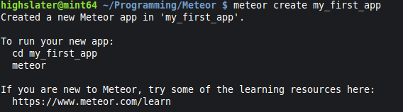
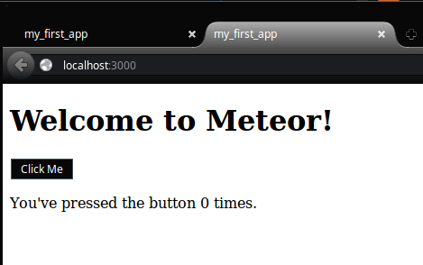
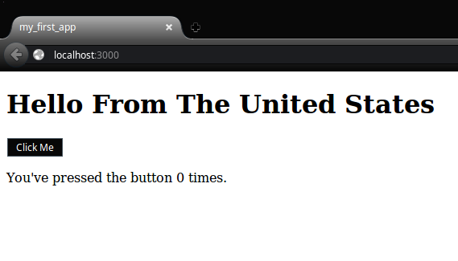
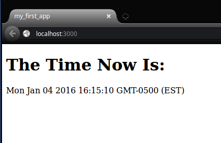

###Module 1 Assignment:

#####Title: Assignment: Install meteor and edit some templates

####Task 1: Install meteor and create a starter app

Install meteor from this site: https://www.meteor.com/install

Once meteor is installed, open up the console or terminal in your operating system and type the command that will create an example application called my_first_app.

Take a screenshot showing what meteor prints to the console when you run the app creation command.

####Task 2: Run the app and view it in your web browser

In the console, run the command to run your newly created meteor app. Point your web browser at the address that meteor tells you your app is running at.

Take another screenshot, showing the app running in your web browser and upload it here. Make sure the address bar of the web browser is visible.
 

####Task 3: Edit the page heading

Edit the template code (.html file) so that it displays a heading 'Hello from here', where you replace 'here' with the country you are in, e.g. I might say: 'Hello from the UK'.

Upload a screenshot showing how this app looks in the web browser.

####Task 4: Create a template helper

Now edit the template helper (.js file) and template code (.html file) so that the page says 'The time now is: now', replacing 'now' with the current time and date. Note that you can access the time and date in Javascript using 'new Date()'.

Take a screenshot of your web browser running the application and upload it here.

